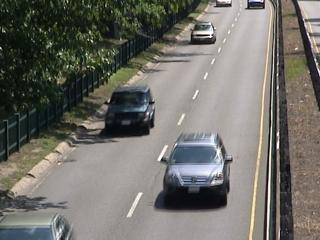
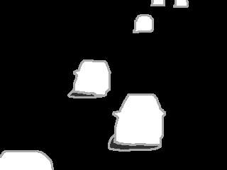
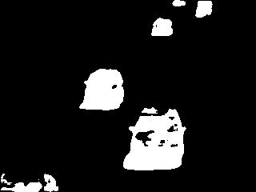

# TRPCA-t-Gamma

Matlab Implementation for the Paper:

Cai, S.; Luo, Q.; Yang, M.; Li, W.; Xiao, M. Tensor Robust Principal Component Analysis via Non-Convex Low Rank Approximation. Appl. Sci. 2019, 9, 1411. https://doi.org/10.3390/app9071411

## Folders
- `algs` includes the proposed method
- `data` contains the data:
  - Berkeley Segmentation Dataset (BSD)
  - four color videos: Hall, MovedObject, Escalator and Lobby
  - parts of ChangeDetection.net(CDNet) dataset2014
- `utils` includes some utilities scripts

## Files
- `test_Image_Recovery` is the script for image recovery on BSD;
- `test_BM_Qualitative` is the script for background modeling on four surveillance videos;
- `test_BM_Quantitative` is the script for background segmentation on parts of CDNet dataset2014

## Partial Results 
Here are some results from the proposed method only. 
- #### Image Recovery
  
- #### Background Modeling on CDNet dataset2014
  

    
     
    
  

